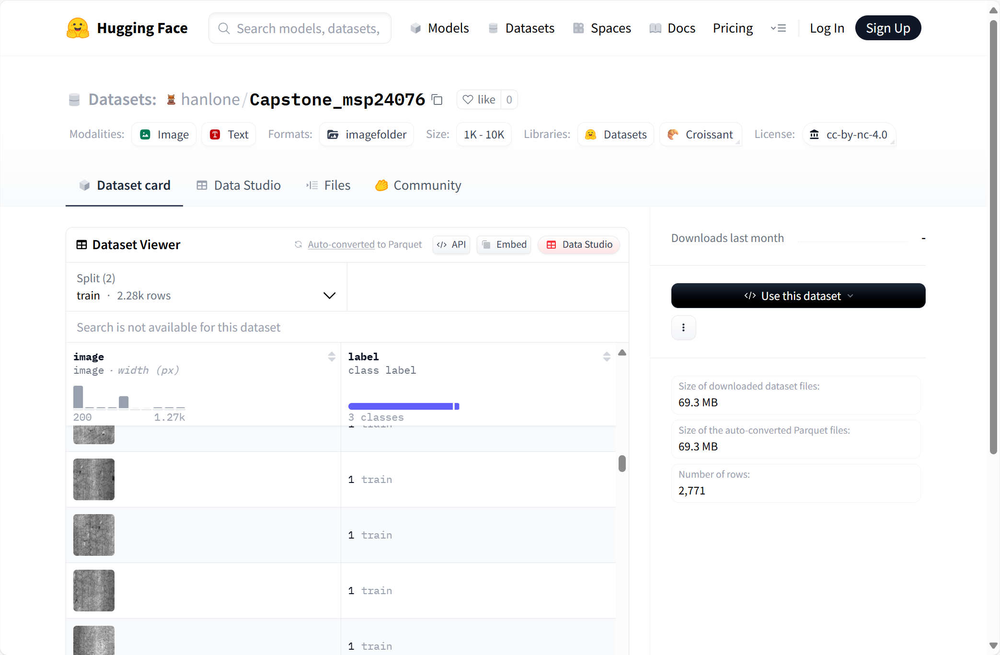

# Installation Guide

## 1. Recommended Installation Methods (choose one)

### Pip Installation (Recommended)

Suitable for most users, supporting stable or development versions:

**Stable version (PyPI)**:

```bash
pip install ultralytics
```

**Development version (latest GitHub code)**:

```bash
pip install git+https://github.com/ultralytics/ultralytics.git@main
```

### Conda Installation

  Ideal for users working with Conda environments:

**Basic installation**:

```bash
conda install -c conda-forge ultralytics
```

**CUDA environments (install with PyTorch components)**:

```bash
conda install -c pytorch -c nvidia -c conda-forge pytorch torchvision pytorch-cuda=11.8 ultralytics
```

### Git Clone (For Development)

  Suitable for modifying source code or contributing to development:

```bash
# Clone the repository
git clone https://github.com/ultralytics/ultralytics
cd ultralytics
# Install in editable mode (no need to reinstall after code modifications)
pip install -e .
```

### Docker Installation (Isolated Environment)

  Provides multiple images (GPU/CPU/ARM64, etc.) for consistent environments:

```bash
# Pull the latest image
t=ultralytics/ultralytics:latest
sudo docker pull $t
# Run the container (with GPU support)
sudo docker run -it --ipc=host --gpus all $t # All GPUs
sudo docker run -it --ipc=host --gpus '"device=2,3"' $t # Specific GPUs
# Mount local directory to the container
sudo docker run -it --ipc=host --gpus all -v /local/path:/container/path $t
```

## 2. Dependency Notes

Ultralytics depends on PyTorch. It is recommended to install PyTorch first according to your system and CUDA requirements. Refer to the [official PyTorch guide](https://pytorch.org/get-started/locally/).

You should also download dataset and some pretrained model weight files.

You can input the following commands in you terminal.

```bash
git lfs install

git clone https://huggingface.co/datasets/hanlone/Capstone_msp24076
```

Or access  [hanlone/Capstone_msp24076 · Datasets at Hugging Face](https://huggingface.co/datasets/hanlone/Capstone_msp24076) to download dataset and pretrained model weight files.



Replace the empty folders with the same names in the project root directory with the downloaded dataset.

Finally, organize your project like:

```bash
.
├─── NEU-COCO/
|   ├─── images/
|   |   ├─── train/
|   |   |   ├─── crazing_1.jpg
|   |   |   └─── crazing_100.jpg
|   |   |   └─── ... (1438 more items)
|   |   └─── val/
|   |       ├─── crazing_10.jpg
|   |       └─── crazing_102.jpg
|   |       └─── ... (358 more items)
|   └─── labels/
|       ├─── train/
|       |   ├─── crazing_1.txt
|       |   └─── crazing_100.txt
|       |   └─── ... (1438 more items)
|       └─── train.cache
|       └─── ... (2 more items)
├─── cfg/
|   ├─── NEU.yaml
|   └─── coco128-seg.yaml
|   └─── ... (3 more items)
├─── coco128-seg/
|   ├─── images/
|   |   └─── train2017/
|   |       ├─── 000000000009.jpg
|   |       └─── 000000000025.jpg
|   |       └─── ... (126 more items)
|   └─── labels/
|       ├─── train2017/
|       |   ├─── 000000000009.txt
|       |   └─── 000000000025.txt
|       |   └─── ... (126 more items)
|       └─── train2017.cache
├─── coco8/
|   ├─── images/
|   |   ├─── train/
|   |   |   ├─── 000000000009.jpg
|   |   |   └─── 000000000025.jpg
|   |   |   └─── ... (2 more items)
|   |   └─── val/
|   |       ├─── 000000000036.jpg
|   |       └─── 000000000042.jpg
|   |       └─── ... (2 more items)
|   └─── labels/
|       ├─── train/
|       |   ├─── 000000000009.txt
|       |   └─── 000000000025.txt
|       |   └─── ... (2 more items)
|       └─── train.cache
|       └─── ... (2 more items)
├─── ours-COCO/
|   ├─── data.yaml
|   └─── images/
|       ├─── train/
|       |   ├─── 0-2cm_1-1_jpg.rf.764bea29ece519d80197eb39eaacddb3.jpg
|       |   └─── 0-2cm_1-1_jpg.rf.b45a69af379f166fea03e5d0e777da4f.jpg
|       |   └─── ... (163 more items)
|       └─── val/
|           ├─── 0-2cm_1-4_jpg.rf.2457dfe2f37b21e3206b54ccd0686b2d.jpg
|           └─── 0-3cm_1-3_jpg.rf.a5e796cee5d3885373b729c3246d088b.jpg
|           └─── ... (11 more items)
|   └─── ... (1 more items)
├─── scratches_notprocessed/
|   ├─── train/
|   |   ├─── images/
|   |   |   ├─── 0_2cm_2_1_jpg.rf.41cc8182fbea48c8ceff8205aa91a517.jpg
|   |   |   └─── 0_2cm_2_1_jpg.rf.96d8b7e1b365b210a7737b2822377cd3.jpg
|   |   |   └─── ... (22 more items)
|   |   └─── labels/
|   |       ├─── 0_2cm_2_1_jpg.rf.41cc8182fbea48c8ceff8205aa91a517.txt
|   |       └─── 0_2cm_2_1_jpg.rf.96d8b7e1b365b210a7737b2822377cd3.txt
|   |       └─── ... (22 more items)
|   └─── valid/
|       ├─── images/
|       |   ├─── 0_2cm_1_1_jpg.rf.b965a2854f2b3daa258e21268c746561.jpg
|       |   └─── 0_2cm_1_2_jpg.rf.3036c8ad9b69092e22a5d5ba6b5a9c9d.jpg
|       |   └─── ... (58 more items)
|       └─── labels/
|           ├─── 0_2cm_1_1_jpg.rf.b965a2854f2b3daa258e21268c746561.txt
|           └─── 0_2cm_1_2_jpg.rf.3036c8ad9b69092e22a5d5ba6b5a9c9d.txt
|           └─── ... (58 more items)
├─── synthetic_images_0625/
|   ├─── images/
|   |   ├─── train/
|   |   |   ├─── 0_5cm_1_1_jpg.rf.1374c3d09f1fd6aa3fe0f462f2b4fec1.jpg
|   |   |   └─── 0_5cm_1_1_jpg.rf.49ef2022e34e7efc7a9223d41c8767f3.jpg
|   |   |   └─── ... (517 more items)
|   |   └─── val/
|   |       ├─── 0_2cm_1_1_jpg.rf.178c389f2d32186f08cba42204a83dfe.jpg
|   |       └─── 0_2cm_1_2_jpg.rf.b693d3b22aca3390b43c10cc429968a5.jpg
|   |       └─── ... (52 more items)
|   └─── labels/
|       ├─── train/
|       |   ├─── 0_5cm_1_1_jpg.rf.1374c3d09f1fd6aa3fe0f462f2b4fec1.txt
|       |   └─── 0_5cm_1_1_jpg.rf.49ef2022e34e7efc7a9223d41c8767f3.txt
|       |   └─── ... (517 more items)
|       └─── train.cache
|       └─── ... (2 more items)
├─── synthetic_train.py
├─── synthetic.py
├─── cuda_tests.py
├─── README.md
├─── scratch_pose.py
├─── test_different_model.py
├─── FastSAM-s.pt
├─── yolo11n-pose.pt
├─── yolo11n.pt
├─── yolov10n.pt
├─── yolov5nu.pt
└─── yolov8n.pt
```

## 3. Basic Usage (After Installation)

Use `cuda_test.py` to verify your installation. You should see the following:

```bash
2.6.0+cu118
True
11.8
0.21.0+cu118
```

as output of:

```python
print(torch.__version__)          # Check PyTorch version
print(torch.cuda.is_available())  # Output True if GPU support is available, False otherwise
print(torch.version.cuda)         # Show CUDA version used by PyTorch (None if CPU-only version)
print(torchvision.__version__)    # Check torchvision version
```

then a YOLO11n model is trained on COCO8 dataset. You should see the similar Result:

```bash
Ultralytics 8.3.107 🚀 Python-3.10.16 torch-2.6.0+cu118 CUDA:0 (NVIDIA GeForce RTX 4060 Laptop GPU, 8188MiB)
YOLO11n summary (fused): 100 layers, 2,616,248 parameters, 0 gradients, 6.5 GFLOPs
                 Class     Images  Instances      Box(P          R      mAP50  mAP50-95): 100%|██████████| 1/1 [00:00<00:00, 28.55it/s]
                   all          4         17      0.598      0.683      0.624      0.459
                person          3         10      0.327        0.6      0.469      0.232
                   dog          1          1      0.617          1      0.995      0.796
                 horse          1          2      0.307          1      0.663      0.354
              elephant          1          2      0.797        0.5       0.62      0.374
              umbrella          1          1      0.541          1      0.995      0.995
          potted plant          1          1          1          0          0          0
Speed: 0.1ms preprocess, 2.2ms inference, 0.0ms loss, 0.8ms postprocess per image
Results saved to runs\detect\train

Process finished with exit code 0
```

You can use `synthetic.py`  and original real images under folder `scratches_notprocessed` to generate metal scratch images.

You can use `test_different_model.py` to compare the performance of  `YOLOv5`,`YOLOv8`, `YOLOv10`,  and `YOLO11`.

You can use `scratch_pose.py` to train `YOLOv11-pose` on our original `Scratch-Pose` dataset.

You can use `synthetic_train.py` to train `YOLOv11` on our original synthetic dataset.
